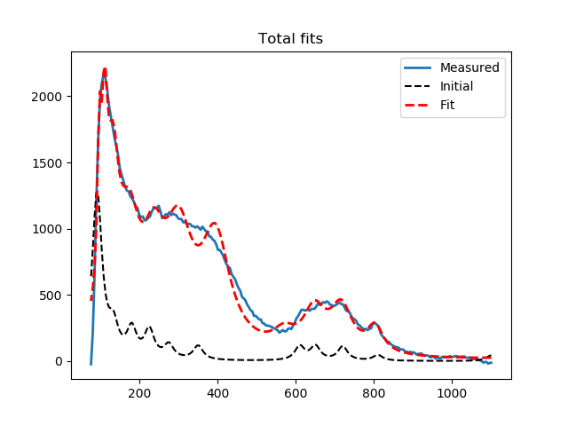
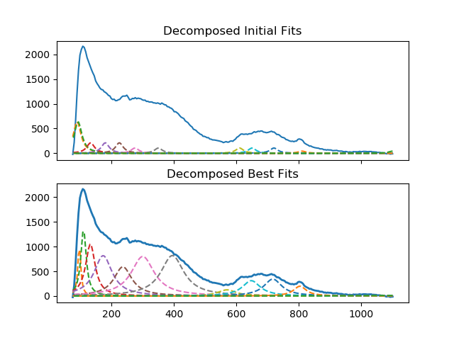
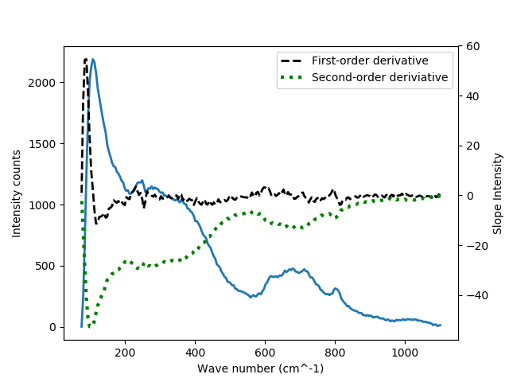

# spectra_fit

A small python module for fitting peaks and analyzing 1D spectra, e.g., Raman spectra base on user initial guesses.
Example data measured for WO3 deposited on STO, and collected with the help of Katherine Kanipe and Professor Martin Moskovits at UCSB.

Basic capabilities:
   - fit spectra with decomposed peaks (Gaussian, Lorentzian, Voigt fits)
   - take difference of two spectra
   - smooth peaks for easier peak finding and first-order derivatives
   - take first-derivative using finite difference

Example output:






``` bash

Imported data: 0.00 s
Set initial parameters: 0.03 s
Fit model: 58.02 s
Updated parameters: 58.02 s
[[Model]]
    (((((((((((Model(lorentzian, prefix='L1_') + Model(lorentzian, prefix='L2_')) + Model(lorentzian, prefix='L3_')) + Model(lorentzian, prefix='L4_')) + Model(lorentzian, prefix='L5_')) + Model(lorentzian, prefix='L6_')) + Model(lorentzian, prefix='L7_')) + Model(lorentzian, prefix='L8_')) + Model(lorentzian, prefix='L9_')) + Model(lorentzian, prefix='L10_')) + Model(lorentzian, prefix='L11_')) + Model(lorentzian, prefix='L12_'))
[[Fit Statistics]]
    # fitting method   = leastsq
    # function evals   = 34261
    # data points      = 239
    # variables        = 36
    chi-square         = 1059042.22
    reduced chi-square = 5216.95675
    Akaike info crit   = 2078.74245
    Bayesian info crit = 2203.89514
##  Warning: uncertainties could not be estimated:
    L8_center:      at boundary
[[Variables]]
    L1_sigma:       5.61039335 (init = 15)
    L1_center:      96.9581652 (init = 90)
    L1_amplitude:   18411.8133 (init = 30000)
    L1_fwhm:        11.2207867 == '2.0000000*L1_sigma'
    L1_height:      1044.60812 == '0.3183099*L1_amplitude/max(1.e-15, L1_sigma)'
    L2_sigma:       10.3322141 (init = 15)
    L2_center:      110.363497 (init = 93)
    L2_amplitude:   44079.2599 (init = 30000)

```
